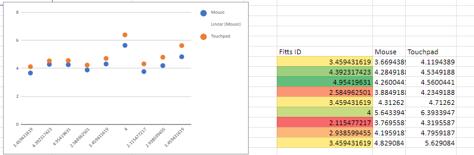

# Performance Comparison between Mouse and Touchpad in a Unity Project

## Introduction
In this report, we analyze the performance differences between using a Mouse and a Touchpad in a Unity-based 
application. The experiment involved clicking on targets to measure the time taken for each input method. 
Additionally, a Fitts Law analysis was conducted to evaluate the efficiency of both input devices.

## Methodology
### Experimental Setup
The Unity project consisted of a series of circular targets varying in size and distance apart which the user
has to click as quickly and as efficiently as possible. Each of the three participants performed this task
mulitple times with both devices. 

### Data Collection
Data was collected by saving the ingame information to a CSV file which was later anaylized using Google Sheets. The Fitts Law index of difficulty (ID) was calculated based on the distance to the target 
and the size of the target.

### Fitts Law Analysis
A Fitts Law graph was generated to visualize the relationship between the time taken (in seconds) and 
the Fitts ID for both input devices. The graph clearly shows the performance differences between the Mouse 
and Touchpad.

## Results
### Performance Comparison
The results indicate that the Mouse consistently outperformed the Touchpad in terms of both 
speed and consistency. On average, participants were able to click targets faster when using 
the Mouse compared to the Touchpad.

### Fitts Law Analysis Results
According to the Fitts Law graph, the Mouse shows a lower slope, indicating faster movement times 
across different levels of difficulty compared to the Touchpad, which has a steeper slope.

## Project Execution
### Individual Contribution
I undertook the entire project independently, including designing and implementing the Unity project, 
conducting the experiments, collecting data, and analyzing the results.

### Challenges Faced
The main challenge in this project were getting the project working on my laptop as I've had many issues with it
lately. All of the work on unity was done on my home PC and then later downloaded through git to my laptop just
to run the experiment with the trackpad. Other then that this project was easier then the first as the unity
experience gained the first time around carried over.

## Conclusion
In conclusion, the experiment demonstrates that the Mouse is superior to the Touchpad in terms of 
both speed and consistency for clicking tasks in a Unity environment. The Fitts Law analysis further 
supports these findings by illustrating the efficiency differences between the two input devices.

This study contributes valuable insights into the practical implications of input device selection 
in interactive applications, highlighting the importance of considering performance factors such as 
speed and accuracy.

